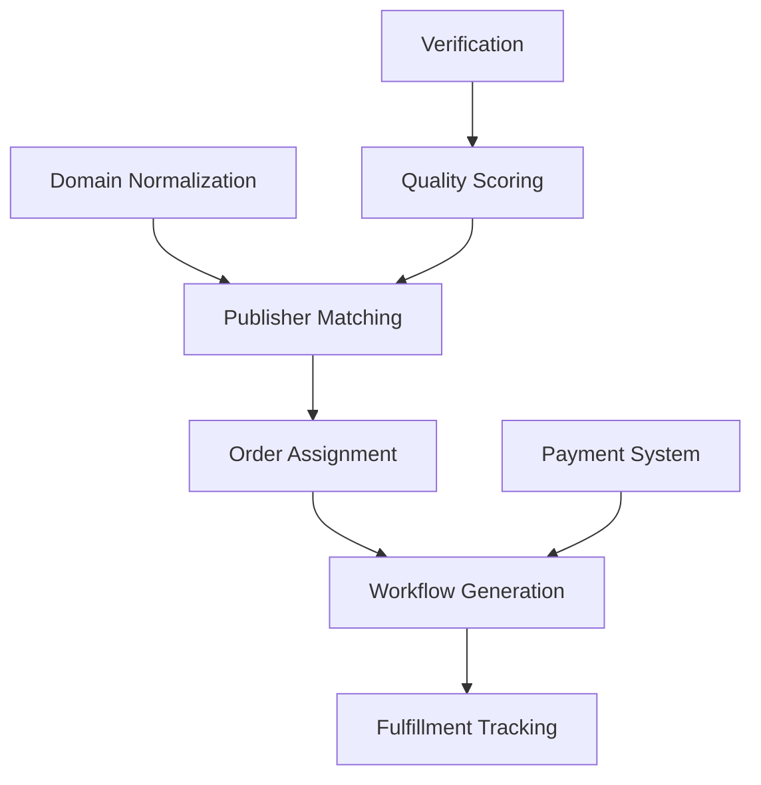
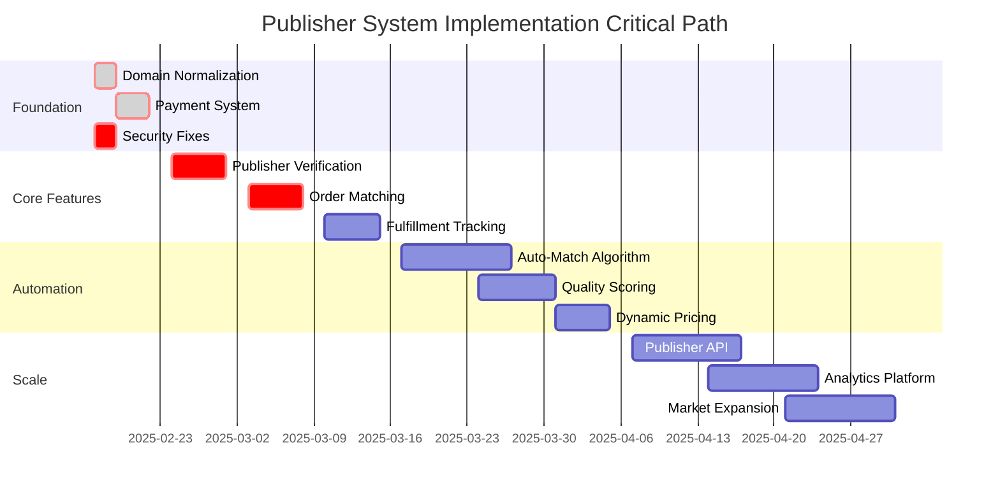

# Publisher Website Management System - Product Strategy & Roadmap

**Version**: 1.0  
**Date**: February 15, 2025  
**Status**: Strategic Planning Document

## Executive Summary

The Publisher Website Management System is a critical component of our B2B SaaS managed service platform, connecting high-quality publishers with advertisers seeking guest post opportunities. This document outlines the comprehensive product strategy, prioritization framework, and implementation roadmap to transform the current foundation into a scalable, revenue-generating platform.

---

## 1. Product Vision & Strategy

### 1.1 Business Objectives

#### Primary Goals
- **Reduce Order Fulfillment Time**: From 14+ days to 7 days average
- **Scale Publisher Network**: From ~950 websites to 10,000+ quality sites
- **Increase Operational Margin**: From 35% to 55% through automation
- **Improve Client Retention**: From 70% to 85% annual retention rate

#### Success Metrics (Q1-Q2 2025)
| Metric | Current | Q1 Target | Q2 Target | Impact |
|--------|---------|-----------|-----------|---------|
| Order-to-Publication Time | 14 days | 10 days | 7 days | Client satisfaction |
| Publisher Network Size | 948 sites | 2,500 sites | 5,000 sites | Inventory growth |
| Auto-match Success Rate | 0% | 40% | 70% | Operational efficiency |
| Publisher Verification Rate | <10% | 50% | 80% | Quality assurance |
| Revenue per Order | $450 | $475 | $525 | Margin improvement |
| Internal Hours per Order | 3.5 hrs | 2.5 hrs | 1.5 hrs | Cost reduction |

### 1.2 User Personas & Needs

#### Persona 1: Publisher Partners
**Profile**: Website owners, editors, and brokers managing 1-50 sites  
**Primary Needs**:
- Easy website claiming and verification process
- Flexible pricing and offering management
- Clear order pipeline visibility
- Timely payments and reporting

**Pain Points**:
- Manual email-based order management
- No centralized pricing control
- Unclear content requirements
- Delayed payment processing

#### Persona 2: Internal Operations Team
**Profile**: Account managers handling 20-50 orders weekly  
**Primary Needs**:
- Automated publisher matching
- Quality verification tools
- Bulk operation capabilities
- Exception handling workflows

**Pain Points**:
- Manual domain-to-publisher matching
- No automated quality checks
- Duplicate website entries
- Time-consuming verification process

#### Persona 3: Advertiser Clients
**Profile**: Marketing managers seeking 5-50 guest posts monthly  
**Primary Needs**:
- Quality site recommendations
- Transparent pricing
- Fast turnaround times
- Consistent content quality

**Pain Points**:
- Limited site inventory visibility
- Slow fulfillment process
- Inconsistent publisher quality
- Lack of performance tracking

### 1.3 Competitive Advantage & Unique Value Proposition

#### Our Moat
1. **Proprietary Publisher Network**: Direct relationships with 1,000+ verified publishers
2. **Quality-First Approach**: Manual verification + AI-powered quality scoring
3. **Managed Service Excellence**: Full-service handling vs marketplace chaos
4. **Relationship Capital**: Long-term publisher partnerships with preferential pricing
5. **Operational Intelligence**: Data-driven matching and pricing optimization

#### Value Proposition
"We deliver premium guest post placements 2x faster than competitors through our verified publisher network and intelligent matching system, while maintaining the highest content quality standards in the industry."

### 1.4 Revenue Model & Pricing Strategy

#### Current Model (Baseline)
- **Service Fee**: $79 per link (fixed)
- **Publisher Cost**: $200-800 per placement (variable)
- **Gross Margin**: ~35%

#### Enhanced Model (Target)
```
Revenue Streams:
1. Core Service Fee: $89-149 per link (tiered by volume)
2. Rush Processing: +$50 per link (<72 hour turnaround)
3. Premium Publishers: +25% markup for DR70+ sites
4. Content Creation: $150-300 per article (optional add-on)
5. Reporting Dashboard: $99/month (enterprise clients)

Margin Optimization:
- Volume discounts with publishers (10-20% at scale)
- Automated order routing (reduce operational cost 40%)
- Quality-based pricing tiers
- Dynamic pricing based on demand
```

#### Pricing Tiers
| Package | Volume | Price/Link | Features | Target Margin |
|---------|--------|------------|----------|---------------|
| Starter | 1-5 | $149 | Standard turnaround | 40% |
| Growth | 6-20 | $119 | Priority support | 45% |
| Scale | 21-50 | $99 | Dedicated manager | 50% |
| Enterprise | 50+ | $89 | Custom solutions | 55% |

---

## 2. Feature Prioritization Framework

### 2.1 Prioritization Matrix (ICE Scoring)

| Feature | Impact (1-10) | Confidence (1-10) | Effort (1-10) | ICE Score | Priority |
|---------|---------------|-------------------|---------------|-----------|----------|
| Domain normalization fix | 10 | 10 | 2 | 500 | **P0** |
| Publisher auto-matching | 9 | 8 | 5 | 144 | **P0** |
| Payment recording system | 10 | 9 | 3 | 300 | **P0** |
| Bulk verification tools | 8 | 9 | 4 | 162 | **P1** |
| Order flow automation | 9 | 7 | 6 | 105 | **P1** |
| Quality scoring algorithm | 7 | 8 | 5 | 112 | **P1** |
| Publisher API integration | 6 | 7 | 7 | 60 | **P2** |
| Analytics dashboard | 5 | 9 | 6 | 75 | **P2** |
| Mobile app for publishers | 4 | 6 | 9 | 27 | **P3** |

### 2.2 Must-Have vs Nice-to-Have

#### Must-Have (Core Functionality)
✅ **Already Complete**:
- Publisher portal foundation
- Website management interface
- Offering creation system
- Internal admin tools

🔴 **Critical Gaps** (Blocking business):
1. Domain normalization enforcement
2. Payment recording & tracking
3. Publisher-to-order matching
4. Automated verification workflow
5. Order fulfillment integration

#### Should-Have (Efficiency Drivers)
- Bulk import/export tools
- Automated quality scoring
- Publisher performance tracking
- Smart pricing recommendations
- Email notification system

#### Nice-to-Have (Future Enhancements)
- Advanced analytics dashboards
- Publisher mobile app
- API for third-party tools
- AI-powered content matching
- Blockchain payment system

### 2.3 Dependencies & Technical Constraints

#### Critical Dependencies


#### Technical Constraints
- **Database**: PostgreSQL limits for JSONB queries
- **Frontend**: Next.js 15 compatibility issues
- **API**: Rate limiting for external integrations
- **Infrastructure**: Coolify deployment constraints
- **Performance**: 10k+ websites pagination requirements

### 2.4 Quick Wins vs Long-term Investments

#### Quick Wins (< 1 week effort, high impact)
1. **Fix domain normalization** - Prevents duplicates (2 days)
2. **Add payment recording** - Unblocks workflows (3 days)
3. **Create verification checklist** - Improves quality (1 day)
4. **Implement search fixes** - Security & UX (2 days)
5. **Add bulk select** - Operational efficiency (2 days)

#### Strategic Investments (> 2 weeks, transformational)
1. **Auto-matching algorithm** - Core automation (4 weeks)
2. **Quality scoring system** - Competitive advantage (3 weeks)
3. **Publisher API** - Scalability enabler (6 weeks)
4. **Analytics platform** - Data-driven decisions (4 weeks)
5. **Marketplace transition** - Business model evolution (12 weeks)

---

## 3. Implementation Roadmap

### Phase 1: Critical Fixes & Foundation (Week 1-2)
**Goal**: Stabilize system and fix blocking issues

#### Week 1: Data Integrity & Security
- [ ] Day 1-2: Domain normalization migration and enforcement
  - Run migration script on production
  - Update all input points to use normalizer
  - Create duplicate resolution tool
- [ ] Day 3: Security vulnerability fixes
  - SQL injection prevention
  - Input validation on all forms
  - CSRF protection implementation
- [ ] Day 4-5: Payment recording system
  - Create payment recording API
  - Add payment UI to order management
  - Test workflow generation with payments

#### Week 2: Core Functionality Completion
- [ ] Day 6-7: Publisher verification workflow
  - Verification checklist UI
  - Audit trail implementation
  - Bulk verification tools
- [ ] Day 8-9: Order-to-publisher connection
  - Domain matching service
  - Assignment interface
  - Publisher notification system
- [ ] Day 10: Testing & deployment prep
  - End-to-end flow testing
  - Performance optimization
  - Production deployment checklist

**Success Metrics**:
- Zero duplicate domains
- 100% orders have payment tracking
- All critical security issues resolved

### Phase 2: Core Functionality (Week 3-4)
**Goal**: Enable full order-to-fulfillment flow

#### Week 3: Publisher Management
- [ ] Publisher onboarding flow
  - Registration with verification
  - Guided website claiming
  - Offering setup wizard
- [ ] Bulk operations
  - CSV import for websites
  - Mass publisher assignment
  - Batch pricing updates
- [ ] Quality assessment tools
  - Manual rating interface
  - Verification workflow
  - Internal notes system

#### Week 4: Order Integration
- [ ] Auto-matching algorithm v1
  - Basic domain matching
  - Price-based selection
  - Publisher availability check
- [ ] Order routing system
  - Assignment queue
  - Publisher acceptance flow
  - Rejection handling
- [ ] Fulfillment tracking
  - Status updates
  - Timeline tracking
  - Completion verification

**Success Metrics**:
- 50% of orders auto-matched
- Publisher response time < 24 hours
- 80% first-match acceptance rate

### Phase 3: Integration & Optimization (Week 5-6)
**Goal**: Streamline operations and improve efficiency

#### Week 5: Automation & Intelligence
- [ ] Smart matching algorithm v2
  - Niche compatibility scoring
  - Historical performance weighting
  - Geographic optimization
- [ ] Automated quality scoring
  - Metric integration (DR, traffic)
  - Content quality analysis
  - Publisher rating system
- [ ] Dynamic pricing engine
  - Volume-based discounts
  - Seasonal adjustments
  - Competitive pricing analysis

#### Week 6: Communication & Monitoring
- [ ] Notification system
  - Email templates
  - In-app notifications
  - SMS alerts (critical only)
- [ ] Performance dashboards
  - Publisher metrics
  - Order pipeline visibility
  - Revenue tracking
- [ ] Exception handling
  - Escalation workflows
  - Dispute resolution
  - Quality issue tracking

**Success Metrics**:
- 70% orders fully automated
- Average handling time < 1.5 hours
- Publisher satisfaction score > 4.5/5

### Phase 4: Scale & Enhancement (Week 7-8)
**Goal**: Prepare for 10x growth

#### Week 7: Platform Capabilities
- [ ] Publisher API development
  - RESTful endpoints
  - Webhook notifications
  - Rate limiting
- [ ] Advanced analytics
  - Predictive modeling
  - Trend analysis
  - ROI calculations
- [ ] Integration framework
  - CRM connectors
  - Payment gateways
  - Content management systems

#### Week 8: Market Expansion
- [ ] Multi-language support
  - Publisher portal localization
  - Content requirements by region
  - Currency handling
- [ ] Marketplace features
  - Self-service options
  - Publisher bidding system
  - Client direct booking
- [ ] Mobile optimization
  - Progressive web app
  - Publisher mobile experience
  - Push notifications

**Success Metrics**:
- Platform supports 5,000+ websites
- API handles 1,000+ requests/minute
- 30% of orders self-service

---

## 4. Success Metrics & KPIs

### 4.1 Publisher Adoption Metrics

| Metric | Definition | Current | Q1 Target | Q2 Target |
|--------|------------|---------|-----------|-----------|
| Active Publishers | Logged in last 30 days | 0 | 100 | 500 |
| Verified Publishers | Completed verification | 0 | 50 | 250 |
| Websites per Publisher | Average claimed sites | 0 | 3 | 5 |
| Offering Creation Rate | Offerings per publisher | 0 | 2 | 4 |
| Portal Usage Frequency | Logins per week | 0 | 2 | 3 |

### 4.2 Website Management Efficiency

| Metric | Definition | Current | Q1 Target | Q2 Target |
|--------|------------|---------|-----------|-----------|
| Websites in System | Total unique domains | 948 | 2,500 | 5,000 |
| Duplicate Rate | Duplicate domains % | Unknown | <1% | <0.5% |
| Verification Time | Hours to verify | 48+ | 24 | 4 |
| Bulk Import Speed | Sites per minute | 0 | 50 | 100 |
| Data Completeness | Fields filled % | 60% | 85% | 95% |

### 4.3 Order Fulfillment Speed

| Metric | Definition | Current | Q1 Target | Q2 Target |
|--------|------------|---------|-----------|-----------|
| Match Time | Order to assignment | 24+ hrs | 4 hrs | 30 min |
| Acceptance Rate | First match accepts | Unknown | 70% | 85% |
| Publication Time | Assignment to live | 10 days | 7 days | 5 days |
| Automation Rate | Fully automated % | 0% | 40% | 70% |
| Error Rate | Manual intervention % | 100% | 30% | 15% |

### 4.4 Revenue Generation Tracking

| Metric | Definition | Current | Q1 Target | Q2 Target |
|--------|------------|---------|-----------|-----------|
| Avg Order Value | Revenue per order | $450 | $475 | $525 |
| Gross Margin | (Revenue - Costs)/Revenue | 35% | 45% | 55% |
| Publisher Costs | Avg cost per placement | $300 | $275 | $250 |
| Volume Discounts | Savings from scale | 0% | 5% | 10% |
| Upsell Rate | Premium services % | 0% | 15% | 30% |

---

## 5. Risk Mitigation Strategy

### 5.1 Technical Risks

#### Risk: Data Migration Failures
**Impact**: High - Could corrupt publisher relationships  
**Probability**: Medium - Complex data transformations  
**Mitigation**:
- Incremental migration approach
- Comprehensive backup strategy
- Rollback procedures documented
- Staging environment testing
- Data validation scripts

#### Risk: Performance Degradation at Scale
**Impact**: High - System becomes unusable  
**Probability**: Medium - 10x growth planned  
**Mitigation**:
- Database indexing optimization
- Implement caching layers
- Pagination and lazy loading
- Load testing at 10x capacity
- Auto-scaling infrastructure

#### Risk: Security Vulnerabilities
**Impact**: Critical - Data breach potential  
**Probability**: Low - Security fixes implemented  
**Mitigation**:
- Regular security audits
- Penetration testing quarterly
- OWASP compliance checks
- Automated vulnerability scanning
- Security training for team

### 5.2 Business Risks

#### Risk: Publisher Adoption Resistance
**Impact**: High - Network growth blocked  
**Probability**: Medium - Change from current process  
**Mitigation**:
- Phased rollout with top publishers
- Incentive program for early adopters
- Comprehensive training materials
- Dedicated support channel
- Maintain email fallback initially

#### Risk: Quality Degradation from Automation
**Impact**: High - Client satisfaction impact  
**Probability**: Medium - Automation learning curve  
**Mitigation**:
- Human-in-the-loop for exceptions
- Quality scoring thresholds
- Random quality audits
- Client feedback loops
- Gradual automation increase

#### Risk: Competitive Platform Launch
**Impact**: Medium - Market share loss  
**Probability**: High - Growing market  
**Mitigation**:
- Accelerate unique features
- Lock in publisher exclusivity
- Improve client contracts
- Patent key innovations
- Build switching costs

### 5.3 Data Migration Risks

#### Risk: Domain Normalization Breaking Existing Links
**Impact**: High - Orders can't be fulfilled  
**Probability**: Low - Tested thoroughly  
**Mitigation**:
- Maintain mapping table
- Gradual migration approach
- Extensive testing pre-deployment
- Manual override capability
- 24-hour rollback window

#### Risk: Publisher Data Loss
**Impact**: Critical - Business relationships damaged  
**Probability**: Very Low - Backups in place  
**Mitigation**:
- Triple backup strategy
- Point-in-time recovery
- Data integrity checks
- Publisher data export feature
- Legal data retention compliance

### 5.4 User Adoption Challenges

#### Challenge: Internal Team Resistance
**Impact**: Medium - Slowed adoption  
**Probability**: Medium - Change management needed  
**Mitigation**:
- Involve team in design process
- Gradual feature rollout
- Comprehensive training program
- Clear efficiency metrics
- Celebration of wins

#### Challenge: Publisher Portal Complexity
**Impact**: Medium - Low usage rates  
**Probability**: Medium - Many features  
**Mitigation**:
- Progressive disclosure design
- Guided onboarding flow
- Video tutorials library
- In-app help system
- Regular UX testing

### 5.5 Risk Matrix Summary

```
┌─────────────────────────────────────────┐
│         RISK IMPACT                     │
│    Low      Medium      High   Critical │
├─────────────────────────────────────────┤
│ H  │        │Portal   │Publisher│       │ Probability
│ i  │        │Complex  │Adoption │       │ High
│ g  │        │Competit │         │       │
│ h  │        │         │         │       │
├────┼────────┼─────────┼─────────┼───────┤
│ M  │        │Team     │Data Mig │       │ Probability
│ e  │        │Resist   │Perform  │       │ Medium
│ d  │        │         │Quality  │       │
├────┼────────┼─────────┼─────────┼───────┤
│ L  │TypeScript│        │Domain  │Publish│ Probability
│ o  │Issues   │        │Normal  │Data   │ Low
│ w  │         │        │Security│Loss   │
└────┴────────┴─────────┴─────────┴───────┘
```

---

## 6. Implementation Timeline & Milestones

### Q1 2025 Milestones

| Week | Milestone | Success Criteria | Owner |
|------|-----------|------------------|-------|
| 1-2 | Foundation Stabilized | Zero critical bugs, payment system live | Engineering |
| 3-4 | Core Flow Complete | End-to-end order fulfillment working | Product |
| 5-6 | Automation Live | 50% orders auto-matched | Operations |
| 7-8 | Scale Preparation | Support for 5,000 websites | Infrastructure |
| 9-10 | Publisher Onboarding | 100 active publishers | Business Dev |
| 11-12 | Q1 Targets Met | All Q1 metrics achieved | Leadership |

### Critical Path Items



---

## 7. Resource Requirements

### Team Allocation

| Role | Current | Q1 Needs | Q2 Needs | Responsibilities |
|------|---------|----------|----------|-----------------|
| Product Manager | 1 | 1 | 2 | Strategy, roadmap, requirements |
| Backend Engineer | 2 | 3 | 4 | API, database, integrations |
| Frontend Engineer | 1 | 2 | 3 | Portal, dashboard, UX |
| DevOps Engineer | 0.5 | 1 | 1 | Infrastructure, deployment |
| QA Engineer | 0 | 1 | 2 | Testing, quality assurance |
| Data Analyst | 0 | 0.5 | 1 | Metrics, reporting, insights |
| Customer Success | 1 | 2 | 3 | Publisher relations, support |

### Budget Requirements

| Category | Q1 Budget | Q2 Budget | Notes |
|----------|-----------|-----------|-------|
| Infrastructure | $3,000 | $5,000 | Scaling for 10x growth |
| Third-party APIs | $2,000 | $4,000 | DataForSEO, verification services |
| Security Audit | $5,000 | $5,000 | Quarterly penetration testing |
| Training | $2,000 | $3,000 | Team and publisher education |
| Marketing | $5,000 | $10,000 | Publisher acquisition |
| **Total** | **$17,000** | **$27,000** | |

---

## 8. Success Criteria & Go/No-Go Decisions

### Phase 1 Success Gates (Week 2)
✅ **GO Criteria**:
- Domain normalization 100% complete
- Payment system functional
- Zero critical security issues
- Core team trained

❌ **NO-GO Triggers**:
- Data corruption during migration
- Payment system failures
- Unresolved security vulnerabilities

### Phase 2 Success Gates (Week 4)
✅ **GO Criteria**:
- 50+ publishers onboarded
- Auto-matching achieving 50% success
- Order fulfillment < 10 days average
- Zero data integrity issues

❌ **NO-GO Triggers**:
- Publisher adoption < 25
- Auto-matching < 30% success
- Critical bugs in order flow

### Phase 3 Success Gates (Week 6)
✅ **GO Criteria**:
- 70% automation rate achieved
- Quality scores 90% accurate
- Publisher satisfaction > 4.0/5
- Operational costs reduced 30%

❌ **NO-GO Triggers**:
- Automation causing quality issues
- Publisher satisfaction < 3.5/5
- Operational costs increasing

### Phase 4 Success Gates (Week 8)
✅ **GO Criteria**:
- Platform handles 5,000 websites
- API stability > 99.9%
- 30% orders self-service
- Revenue targets met

❌ **NO-GO Triggers**:
- Performance degradation at scale
- API stability < 99%
- Revenue targets missed by >20%

---

## 9. Communication Plan

### Stakeholder Updates

| Audience | Frequency | Format | Content |
|----------|-----------|--------|---------|
| Executive Team | Weekly | Dashboard + Email | KPIs, risks, decisions needed |
| Engineering | Daily | Standup | Progress, blockers, priorities |
| Operations | Bi-weekly | Meeting | Process changes, training |
| Publishers | Monthly | Newsletter | Updates, features, success stories |
| Clients | Quarterly | Report | Improvements, metrics, roadmap |

### Change Management

1. **Week 0**: Announcement and vision sharing
2. **Week 1-2**: Training sessions for internal team
3. **Week 3-4**: Beta program with top publishers
4. **Week 5-6**: Gradual rollout to all publishers
5. **Week 7-8**: Full launch with client communication

---

## 10. Long-term Vision & Evolution

### 6-Month Horizon
- Full marketplace capabilities
- Self-service publisher onboarding
- AI-powered content matching
- Real-time bidding system
- Mobile apps for all users

### 12-Month Horizon
- International expansion (EU, APAC)
- Blockchain payment integration
- Advanced fraud detection
- Predictive analytics platform
- White-label solution offering

### Strategic Pivot Considerations
- **Marketplace Model**: If managed service margins compress below 30%
- **Platform Licensing**: If enterprise clients request white-label
- **Acquisition Target**: If strategic buyer emerges with 10x revenue offer
- **API-First Business**: If integration demand exceeds direct sales

---

## Appendix A: Technical Architecture

### System Components
```
┌─────────────────────────────────────────────────────┐
│                   Load Balancer                     │
└──────────────────────┬──────────────────────────────┘
                       │
┌──────────────────────┴──────────────────────────────┐
│                  Next.js Application                 │
│  ┌────────────┐  ┌─────────────┐  ┌──────────────┐ │
│  │Publisher   │  │Internal     │  │Client        │ │
│  │Portal      │  │Portal       │  │Portal        │ │
│  └────────────┘  └─────────────┘  └──────────────┘ │
└──────────────────────┬──────────────────────────────┘
                       │
┌──────────────────────┴──────────────────────────────┐
│                    API Layer                         │
│  ┌────────────┐  ┌─────────────┐  ┌──────────────┐ │
│  │Auth        │  │Orders       │  │Publishers    │ │
│  │Service     │  │Service      │  │Service       │ │
│  └────────────┘  └─────────────┘  └──────────────┘ │
└──────────────────────┬──────────────────────────────┘
                       │
┌──────────────────────┴──────────────────────────────┐
│                PostgreSQL Database                   │
│  ┌────────────┐  ┌─────────────┐  ┌──────────────┐ │
│  │Publishers  │  │Websites     │  │Orders        │ │
│  │Offerings   │  │Relationships│  │Workflows     │ │
│  └────────────┘  └─────────────┘  └──────────────┘ │
└──────────────────────────────────────────────────────┘
```

### Data Flow
```
Order Creation → Domain Analysis → Publisher Matching →
Assignment → Acceptance → Content Creation → 
Quality Review → Publication → Payment → Completion
```

---

## Appendix B: Competitive Analysis

| Feature | Our Platform | Competitor A | Competitor B | Competitor C |
|---------|--------------|--------------|--------------|--------------|
| Publisher Network | 1,000+ verified | 5,000 unverified | 500 verified | 10,000 mixed |
| Automation Level | 70% (target) | 30% | 50% | 90% |
| Quality Control | Human + AI | AI only | Human only | Minimal |
| Turnaround Time | 7 days | 14 days | 10 days | 3 days |
| Pricing Model | Managed service | Marketplace | Agency | Self-service |
| Client Portal | Full-featured | Basic | None | Advanced |
| Publisher Portal | Comprehensive | None | Email-based | Basic |
| API Access | Coming Q2 | Available | None | Available |
| Mobile Support | PWA | None | None | Native apps |
| Average NPS | 45 (target) | 20 | 35 | 15 |

---

## Document Control

**Author**: Senior Product Management Team  
**Review Cycle**: Bi-weekly  
**Next Review**: March 1, 2025  
**Distribution**: Executive Team, Product, Engineering, Operations

**Version History**:
- v1.0 (2025-02-15): Initial comprehensive strategy
- v0.9 (2025-02-14): Draft for review
- v0.5 (2025-02-10): Initial outline

---

*This document represents the strategic direction for the Publisher Website Management System. All targets and timelines are subject to adjustment based on market conditions, resource availability, and business priorities.*