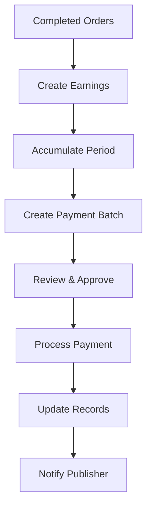

# Order-Publisher Connection Implementation

## Overview

This document outlines the implementation of connecting orders to publishers, enabling automatic order flow, earnings tracking, and commission management.

## Database Schema Design

### 1. Core Tables Added

#### Publisher Earnings (`publisher_earnings`)
- Tracks all earnings for publishers
- Links to order line items for traceability
- Supports multiple earning types (order completion, bonuses, adjustments)
- Includes platform fee calculation
- Payment batch tracking for bulk payments

#### Publisher Payment Batches (`publisher_payment_batches`)
- Groups earnings for payment processing
- Tracks payment status and references
- Supports multiple payment methods
- Error handling and retry tracking

#### Publisher Order Notifications (`publisher_order_notifications`)
- Notification queue for publishers
- Multi-channel support (email, SMS, dashboard)
- Delivery tracking and read receipts
- Retry mechanism for failed notifications

#### Commission Configurations (`commission_configurations`)
- Flexible commission structure
- Scope-based rates (global, publisher, website)
- Tiered commission support
- Time-based validity

#### Publisher Order Analytics (`publisher_order_analytics`)
- Aggregated metrics by period
- Performance tracking
- Financial summaries
- Trend analysis

### 2. Modified Tables

#### Order Line Items (`order_line_items`)
Added columns:
- `publisher_id` - Links to assigned publisher
- `publisher_offering_id` - Specific offering selected
- `publisher_price` - Wholesale price for publisher
- `platform_fee` - Platform commission amount
- `publisher_status` - Publisher-specific workflow status
- Publisher timestamp fields for tracking

## Data Flow Architecture

### 1. Order Creation to Publisher Assignment


**Implementation:**
1. When domain is assigned to line item
2. System finds best matching publisher via `PublisherOrderService.findPublisherForDomain()`
3. Prioritizes by: verification status → priority rank → creation date
4. Calculates platform fee based on commission configuration
5. Updates line item with publisher details
6. Creates notification record

### 2. Publisher Order Workflow

```
States: pending → notified → accepted → in_progress → submitted → approved → published → paid
```

**Key Transitions:**
- `pending → notified`: Automatic when publisher assigned
- `notified → accepted/rejected`: Publisher action required
- `accepted → in_progress`: Publisher starts work
- `in_progress → submitted`: Publisher submits completed work
- `submitted → approved`: Internal team review
- `approved → published`: Confirmation of live content
- `published → paid`: Earnings created and payment processed

### 3. Earnings Calculation

**Formula:**
```
Gross Amount = Publisher Price (from offering)
Platform Fee = Gross Amount × Commission Rate
Net Earnings = Gross Amount - Platform Fee
```

**Commission Priority:**
1. Publisher-specific rate
2. Website-specific rate
3. Global default rate (30%)

### 4. Payment Processing Flow



## API Endpoints

### Publisher-Facing APIs

#### GET /api/publisher/orders
- Lists orders assigned to publisher
- Filterable by status
- Includes earnings information
- Returns summary statistics

#### PATCH /api/publisher/orders
- Accept/reject orders
- Start work on order
- Submit completed work
- Add delivery notes

#### GET /api/publisher/earnings
- View earnings history
- Filter by status
- Export capabilities
- Payment tracking

### Internal APIs

#### POST /api/orders/[id]/line-items/[lineItemId]/assign-domain
- Enhanced to auto-assign publisher
- Calculates commission
- Creates notifications

#### POST /api/orders/[id]/line-items/[lineItemId]/complete
- Triggers earnings creation
- Updates publisher status
- Sends completion notification

#### POST /api/admin/publisher-payments/create-batch
- Groups pending earnings
- Creates payment batch
- Calculates totals

## Service Layer

### PublisherOrderService

Key methods:
- `findPublisherForDomain()` - Intelligent publisher matching
- `assignDomainWithPublisher()` - Complete assignment flow
- `calculatePlatformFee()` - Dynamic commission calculation
- `createEarningsForCompletedOrder()` - Earnings generation
- `createPublisherNotification()` - Multi-channel notifications
- `getPublisherPendingEarnings()` - Financial summaries
- `getPublisherOrderStats()` - Performance metrics

## Migration Strategy

### Phase 1: Database Setup (Immediate)
```sql
-- Run migration
psql -d your_database -f migrations/0050_connect_orders_to_publishers.sql
```

### Phase 2: Backfill Existing Data (Week 1)
1. Identify domains with known publishers
2. Match via website table
3. Update order_line_items with publisher_id
4. Calculate historical earnings

### Phase 3: UI Implementation (Week 2)
1. Publisher dashboard for order management
2. Internal tools for payment processing
3. Analytics and reporting

### Phase 4: Testing & Rollout (Week 3)
1. Test with select publishers
2. Monitor notification delivery
3. Verify earnings calculations
4. Full rollout

## Commission Structure

### Default Configuration
- Platform Fee: 30% of publisher price
- Applied to net earnings
- Configurable per publisher/website

### Custom Rates
```typescript
// Example: Volume-based tiers
{
  scopeType: 'publisher',
  scopeId: 'publisher-uuid',
  tierRules: [
    { minVolume: 0, maxVolume: 10, commissionPercent: 35 },
    { minVolume: 11, maxVolume: 50, commissionPercent: 30 },
    { minVolume: 51, maxVolume: null, commissionPercent: 25 }
  ]
}
```

## Monitoring & Analytics

### Key Metrics to Track
1. **Order Flow**
   - Assignment rate
   - Acceptance rate
   - Completion time
   - Quality scores

2. **Financial**
   - Total earnings by publisher
   - Platform revenue
   - Payment processing time
   - Outstanding balances

3. **Performance**
   - Publisher response time
   - On-time delivery rate
   - Revision rates
   - Client satisfaction

### Database Queries

```sql
-- Publisher earnings summary
SELECT 
  p.company_name,
  COUNT(DISTINCT pe.order_line_item_id) as total_orders,
  SUM(pe.gross_amount) / 100.0 as gross_earnings,
  SUM(pe.platform_fee_amount) / 100.0 as platform_fees,
  SUM(pe.net_amount) / 100.0 as net_earnings,
  SUM(CASE WHEN pe.status = 'paid' THEN pe.net_amount ELSE 0 END) / 100.0 as paid_amount,
  SUM(CASE WHEN pe.status IN ('pending', 'confirmed') THEN pe.net_amount ELSE 0 END) / 100.0 as pending_amount
FROM publisher_earnings pe
JOIN publishers p ON pe.publisher_id = p.id
GROUP BY p.id, p.company_name
ORDER BY net_earnings DESC;

-- Orders awaiting publisher action
SELECT 
  oli.id,
  oli.assigned_domain,
  oli.publisher_status,
  oli.publisher_notified_at,
  EXTRACT(DAY FROM NOW() - oli.publisher_notified_at) as days_waiting
FROM order_line_items oli
WHERE oli.publisher_id IS NOT NULL
  AND oli.publisher_status IN ('pending', 'notified')
ORDER BY oli.publisher_notified_at ASC;
```

## Security Considerations

1. **Authentication**
   - Publishers can only view/modify their own orders
   - Payment approval requires admin role
   - Commission changes require special permission

2. **Data Privacy**
   - Client information limited in publisher view
   - Payment details encrypted
   - Audit trail for all financial transactions

3. **Rate Limiting**
   - API endpoints protected
   - Notification throttling
   - Bulk operation limits

## Error Handling

### Common Scenarios

1. **No Publisher Found**
   - Order proceeds without publisher assignment
   - Manual assignment possible later
   - Alert to operations team

2. **Payment Failure**
   - Retry mechanism with exponential backoff
   - Error logging with details
   - Manual intervention workflow

3. **Notification Delivery Issues**
   - Fallback to dashboard notifications
   - Retry queue for emails
   - Daily summary reports

## Future Enhancements

1. **Automated Publisher Matching**
   - ML-based publisher selection
   - Quality score optimization
   - Load balancing

2. **Advanced Commission Models**
   - Performance-based bonuses
   - Seasonal adjustments
   - Bulk order discounts

3. **Publisher Portal Features**
   - Content calendar integration
   - Bulk order management
   - API access for automation

4. **Financial Integrations**
   - Stripe Connect for payments
   - Automated tax reporting
   - Multi-currency support

## Testing Checklist

- [ ] Publisher assignment logic
- [ ] Commission calculation accuracy
- [ ] Notification delivery
- [ ] Earnings creation trigger
- [ ] Payment batch processing
- [ ] Publisher API permissions
- [ ] Analytics data accuracy
- [ ] Migration script execution
- [ ] Rollback procedures
- [ ] Performance under load

## Support & Troubleshooting

### Common Issues

**Q: Publisher not receiving notifications**
- Check publisher email in database
- Verify notification record status
- Review email service logs

**Q: Incorrect commission calculation**
- Check active commission configuration
- Verify scope hierarchy
- Review calculation logs

**Q: Missing earnings for completed order**
- Verify publisher assignment
- Check order line item status
- Review trigger execution

### Contact
For implementation support, contact the development team.

## Appendix: SQL Helper Functions

```sql
-- Get publisher's current balance
CREATE OR REPLACE FUNCTION get_publisher_balance(p_publisher_id UUID)
RETURNS TABLE(
  total_earnings BIGINT,
  paid_amount BIGINT,
  pending_amount BIGINT,
  available_for_payment BIGINT
) AS $$
BEGIN
  RETURN QUERY
  SELECT 
    COALESCE(SUM(net_amount), 0) as total_earnings,
    COALESCE(SUM(CASE WHEN status = 'paid' THEN net_amount ELSE 0 END), 0) as paid_amount,
    COALESCE(SUM(CASE WHEN status IN ('pending', 'confirmed') THEN net_amount ELSE 0 END), 0) as pending_amount,
    COALESCE(SUM(CASE WHEN status = 'confirmed' AND payment_batch_id IS NULL THEN net_amount ELSE 0 END), 0) as available_for_payment
  FROM publisher_earnings
  WHERE publisher_id = p_publisher_id;
END;
$$ LANGUAGE plpgsql;

-- Calculate publisher performance score
CREATE OR REPLACE FUNCTION calculate_publisher_score(p_publisher_id UUID)
RETURNS DECIMAL(5,2) AS $$
DECLARE
  v_score DECIMAL(5,2);
BEGIN
  SELECT 
    (
      (acceptance_rate * 0.3) +
      (on_time_rate * 0.4) +
      (quality_score * 0.3)
    ) INTO v_score
  FROM (
    SELECT 
      COUNT(*) FILTER (WHERE publisher_status = 'accepted')::DECIMAL / 
        NULLIF(COUNT(*) FILTER (WHERE publisher_status IN ('accepted', 'rejected')), 0) * 100 as acceptance_rate,
      COUNT(*) FILTER (WHERE publisher_status = 'completed' AND 
        publisher_submitted_at <= publisher_accepted_at + INTERVAL '7 days')::DECIMAL / 
        NULLIF(COUNT(*) FILTER (WHERE publisher_status = 'completed'), 0) * 100 as on_time_rate,
      85.0 as quality_score -- Placeholder, implement actual quality scoring
    FROM order_line_items
    WHERE publisher_id = p_publisher_id
  ) stats;
  
  RETURN COALESCE(v_score, 0);
END;
$$ LANGUAGE plpgsql;
```