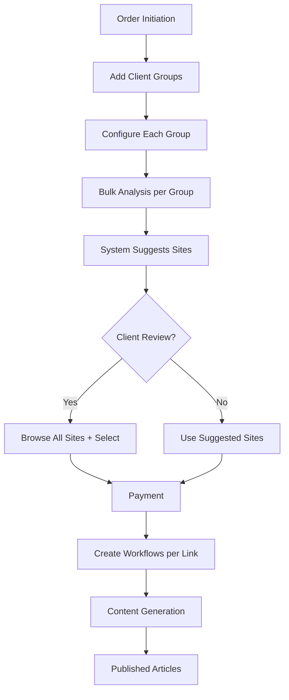

# Order Flow & Account Visibility Architecture

## Complete Order Flow



## Order Lifecycle Stages

### 1. Order Initiation
**Who can initiate:**
- Account (self-service)
- Internal team (on behalf of account)
- Sales team (lead generation)

**Data created:**
- Order ID
- Account ID
- Order type (standard, lead-gen, managed)
- Created by (account user, internal user, sales)

### 2. Order Configuration (Multi-Client)
**What's configured per client group:**
- Client selection from their list
- Number of links for this client
- Target pages for this client
- Anchor text preferences
- Override client's default requirements (optional)

**Benefits:**
- One order can cover 10+ clients
- Saves clicks and time
- Single checkout process

**Account visibility:** FULL - they configure each client group

### 3. Site Identification & Analysis (Per Group)
**Internal process:**
- Each client group gets separate bulk analysis
- System analyzes 20+ domains per group
- Suggests top 5-7 sites
- Categorizes all: High Quality, Good, Marginal, Disqualified

**Account visibility:** FULL BROWSE ACCESS
- See ALL analyzed domains (not just suggested)
- Can pick from alternatives if they don't like suggestions
- View quality metrics for all domains
- HIDDEN: Internal costs, scoring algorithms

### 4. Flexible Site Review
**Review capabilities:**
- View system's suggested sites
- Browse ALL analyzed sites (full transparency)
- Swap suggestions for alternatives
- Assign specific sites to specific target pages
- Set custom anchor text per placement

**Example flow:**
```
Client A needs 2 links:
- System suggests 5 sites
- User approves 1 suggested site for target page #1
- User browses alternatives, picks different site for target page #2
- User sets specific anchor texts for each
```

### 5. Workflow Execution (Per Link)
**Internal process:**
- Create individual workflow for EACH link placement
- Example: Client A (2 links) = 2 workflows
- Each workflow tracks: client, target page, domain, anchor text
- AI agents generate content
- Quality checks

**Account visibility:** PROGRESS VIEW
- Track each workflow individually
- See which client/page each workflow is for
- Preview content drafts
- NO access to AI agent details
- NO access to internal operations

## Use Case Flows

### Use Case 1: Agency Self-Service
```
Account logs in → Creates order → Configures requirements → 
Reviews sites (optional) → Pays → Tracks progress → Downloads content
```

**Visibility needs:**
- Full order management
- Site selection interface
- Progress tracking
- Content preview/approval

### Use Case 2: Managed Service
```
Internal team creates order → Links to account → 
Handles site selection → Account approves → 
Internal team manages fulfillment
```

**Visibility needs:**
- Order approval interface
- Limited configuration access
- Progress updates
- Final deliverables

### Use Case 3: Sales Lead Generation
```
Sales creates demo order → Generates share link → 
Prospect views order → Converts to account → 
Order transfers to account
```

**Visibility needs:**
- Public share view (no login)
- Order preview with sample sites
- Easy conversion flow
- Account creation from order

## Data Relationships for Visibility

### Order → Groups → Bulk Analysis
```sql
-- Get all domains for a client group (not just selected)
SELECT 
  bad.*,
  CASE 
    WHEN oss.id IS NOT NULL THEN oss.status
    ELSE 'available'
  END as selection_status
FROM order_groups og
JOIN bulk_analysis_projects bap ON og.bulk_analysis_project_id = bap.id
JOIN bulk_analysis_domains bad ON bad.project_id = bap.id
LEFT JOIN order_site_selections oss ON oss.domain_id = bad.id
WHERE og.id = :groupId
```

**What accounts see:**
- ALL domains analyzed for each client group
- Which ones were suggested vs available
- Full browsing capability
- Can select any analyzed domain

### Order → Workflows (Per Link)
```sql
-- Each approved site selection becomes a workflow
SELECT 
  w.*,
  og.client_id,
  c.name as client_name,
  oss.target_page_url,
  oss.anchor_text
FROM workflows w
JOIN order_site_selections oss ON w.site_selection_id = oss.id
JOIN order_groups og ON oss.order_group_id = og.id
JOIN clients c ON og.client_id = c.id
WHERE og.order_id = :orderId
```

**Workflow granularity:**
- 1 workflow per link placement
- Tracks: client, target page, domain, anchor
- Clear attribution for each piece of work

## Implementation Strategy

### 1. Order-Centric Navigation
Organize by order, then by client group:

```
/account/orders
  ├── /[orderId]
  │   ├── /overview           (all client groups)
  │   ├── /groups/[groupId]
  │   │   ├── /sites          (ALL analyzed sites)
  │   │   ├── /review         (site selection)
  │   │   └── /workflows      (link-specific progress)
  │   ├── /payment           (for entire order)
  │   └── /deliverables      (all content)
```

### 2. Context-Aware Data Loading
```typescript
// Load bulk analysis domains in order context
async function getOrderSites(orderId: string, accountId: string) {
  // Verify order belongs to account
  const order = await verifyOrderAccess(orderId, accountId);
  
  // Get only domains analyzed for this order
  const domains = await db.query.bulkAnalysisDomains.findMany({
    where: and(
      eq(bulkAnalysisDomains.projectId, order.analysisProjectId),
      // Additional filters
    ),
    columns: {
      // Exclude internal fields
      internalNotes: false,
      costData: false,
    }
  });
}
```

### 3. Share Link System
```typescript
// For sales lead generation
interface OrderShareToken {
  id: string;
  orderId: string;
  token: string;
  expiresAt: Date;
  allowedActions: ['view', 'convert'];
  usedAt?: Date;
}
```

### 4. Order State Machine
```typescript
enum OrderState {
  DRAFT = 'draft',              // Being configured
  PENDING_REVIEW = 'pending_review',  // Sites ready for review
  PENDING_PAYMENT = 'pending_payment', // Approved, awaiting payment
  IN_PROGRESS = 'in_progress',   // Workflows active
  COMPLETED = 'completed'        // All delivered
}
```

## Key Architectural Decisions

1. **Multi-Client Orders**: One order can contain multiple client groups to save time
2. **Full Transparency in Review**: Show ALL analyzed sites, not just pre-selected
3. **Per-Link Workflows**: Each link placement gets its own workflow for clear tracking
4. **Client-Level Defaults**: Site requirements stored at client level, overridable per order
5. **Flexible Site Selection**: Users can pick any analyzed site, not limited to suggestions

## Benefits of This Approach

- **Efficiency**: Agencies can process 10 clients in one order
- **Transparency**: "Behind the curtain" view builds trust
- **Flexibility**: Not locked into system suggestions
- **Clarity**: Each workflow clearly tied to specific client/page/link
- **Simplicity**: Requirements set once at client level