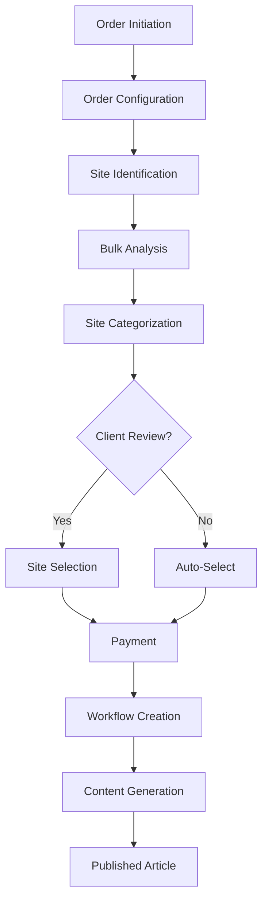

# Order Flow & Account Visibility Architecture

## Complete Order Flow



## Order Lifecycle Stages

### 1. Order Initiation
**Who can initiate:**
- Account (self-service)
- Internal team (on behalf of account)
- Sales team (lead generation)

**Data created:**
- Order ID
- Account ID
- Order type (standard, lead-gen, managed)
- Created by (account user, internal user, sales)

### 2. Order Configuration
**What's configured:**
- Number of links needed
- Target clients/pages (from account's client list)
- Anchor text preferences
- Site requirements (if any)
- Budget constraints

**Account visibility:** FULL - they need to see/edit their requirements

### 3. Site Identification & Analysis
**Internal process:**
- Pull domains from database
- Run bulk analysis
- Categorize: High Quality, Good, Marginal, Disqualified

**Account visibility:** FILTERED
- See final categorized results
- Hide internal scoring algorithms
- Hide cost calculations
- Show only domains relevant to their order

### 4. Client Review (Optional)
**When triggered:**
- Account preference
- Order value threshold
- First-time orders

**Account visibility:** INTERACTIVE
- Review categorized sites
- Select/deselect sites
- See DR, traffic, relevance scores
- Approve final list

### 5. Workflow Execution
**Internal process:**
- Create workflow for each selected site
- Assign to team members
- Generate content via AI agents
- Quality checks

**Account visibility:** PROGRESS VIEW
- See workflow status (pending, writing, reviewing, published)
- Preview content drafts
- NO access to AI agent details
- NO access to internal notes

## Use Case Flows

### Use Case 1: Agency Self-Service
```
Account logs in → Creates order → Configures requirements → 
Reviews sites (optional) → Pays → Tracks progress → Downloads content
```

**Visibility needs:**
- Full order management
- Site selection interface
- Progress tracking
- Content preview/approval

### Use Case 2: Managed Service
```
Internal team creates order → Links to account → 
Handles site selection → Account approves → 
Internal team manages fulfillment
```

**Visibility needs:**
- Order approval interface
- Limited configuration access
- Progress updates
- Final deliverables

### Use Case 3: Sales Lead Generation
```
Sales creates demo order → Generates share link → 
Prospect views order → Converts to account → 
Order transfers to account
```

**Visibility needs:**
- Public share view (no login)
- Order preview with sample sites
- Easy conversion flow
- Account creation from order

## Data Relationships for Visibility

### Order → Bulk Analysis Projects
```sql
-- Link orders to relevant bulk analysis domains
SELECT bad.* 
FROM bulk_analysis_domains bad
JOIN order_site_selections oss ON bad.id = oss.domain_id
WHERE oss.order_id = :orderId
```

**What accounts see:**
- Domains analyzed for their order
- Status (selected, rejected, pending)
- Quality metrics
- NOT internal costs or margins

### Order → Workflows
```sql
-- Link orders to fulfillment workflows
SELECT w.*
FROM workflows w
JOIN order_items oi ON w.order_item_id = oi.id
WHERE oi.order_id = :orderId
```

**What accounts see:**
- Workflow progress
- Content drafts
- Publishing status
- NOT agent conversations or internal config

## Implementation Strategy

### 1. Order-Centric Navigation
Instead of showing raw bulk analysis or workflows, organize everything under orders:

```
/account/orders
  ├── /[orderId]
  │   ├── /details        (configuration)
  │   ├── /sites          (bulk analysis results)
  │   ├── /review         (site selection)
  │   ├── /progress       (workflow tracking)
  │   └── /deliverables   (final content)
```

### 2. Context-Aware Data Loading
```typescript
// Load bulk analysis domains in order context
async function getOrderSites(orderId: string, accountId: string) {
  // Verify order belongs to account
  const order = await verifyOrderAccess(orderId, accountId);
  
  // Get only domains analyzed for this order
  const domains = await db.query.bulkAnalysisDomains.findMany({
    where: and(
      eq(bulkAnalysisDomains.projectId, order.analysisProjectId),
      // Additional filters
    ),
    columns: {
      // Exclude internal fields
      internalNotes: false,
      costData: false,
    }
  });
}
```

### 3. Share Link System
```typescript
// For sales lead generation
interface OrderShareToken {
  id: string;
  orderId: string;
  token: string;
  expiresAt: Date;
  allowedActions: ['view', 'convert'];
  usedAt?: Date;
}
```

### 4. Order State Machine
```typescript
enum OrderState {
  DRAFT = 'draft',              // Being configured
  PENDING_REVIEW = 'pending_review',  // Sites ready for review
  PENDING_PAYMENT = 'pending_payment', // Approved, awaiting payment
  IN_PROGRESS = 'in_progress',   // Workflows active
  COMPLETED = 'completed'        // All delivered
}
```

## Key Decisions

1. **Order-Centric UI**: Everything is accessed through orders, not standalone bulk analysis or workflows
2. **Smart Filtering**: Accounts only see data related to their orders
3. **Progressive Disclosure**: More details revealed as order progresses
4. **Share Links**: Enable sales process without account creation
5. **Flexible Review**: Client review is optional based on configuration

This structure accommodates all three use cases while maintaining clean separation between internal operations and account visibility.