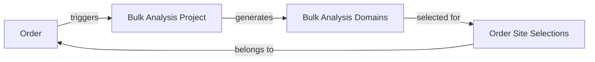
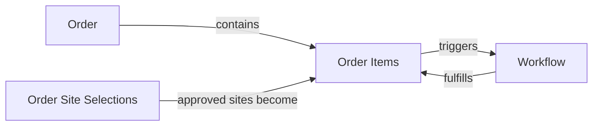

# Order System Schema Design

## Current vs Required Schema

### Current Structure (Problematic)
- Orders exist but disconnected from bulk analysis
- Workflows linked to orders but not to specific sites
- No way to track which bulk analysis led to which order
- No client review mechanism
- No share/preview system

### Required Structure
Orders need to be the central organizing principle, with clear relationships to:
1. Bulk analysis projects (for site discovery)
2. Site selections (client review)
3. Workflows (fulfillment tracking)
4. Share tokens (sales process)

## New Schema Tables

### 1. Order State Tracking
```sql
-- Add to orders table
ALTER TABLE orders ADD COLUMN state VARCHAR(50) DEFAULT 'draft';
ALTER TABLE orders ADD COLUMN analysis_project_id UUID REFERENCES bulk_analysis_projects(id);
ALTER TABLE orders ADD COLUMN requires_client_review BOOLEAN DEFAULT false;
ALTER TABLE orders ADD COLUMN reviewed_at TIMESTAMP;
ALTER TABLE orders ADD COLUMN reviewed_by UUID;
```

### 2. Order Site Selections
```sql
CREATE TABLE order_site_selections (
  id UUID PRIMARY KEY DEFAULT gen_random_uuid(),
  order_id UUID NOT NULL REFERENCES orders(id) ON DELETE CASCADE,
  domain_id UUID NOT NULL REFERENCES bulk_analysis_domains(id),
  status VARCHAR(50) NOT NULL DEFAULT 'pending', -- pending, approved, rejected
  client_notes TEXT,
  internal_notes TEXT,
  selected_at TIMESTAMP,
  selected_by UUID REFERENCES users(id),
  created_at TIMESTAMP NOT NULL DEFAULT NOW(),
  updated_at TIMESTAMP NOT NULL DEFAULT NOW()
);

CREATE INDEX idx_order_site_selections_order ON order_site_selections(order_id);
CREATE INDEX idx_order_site_selections_status ON order_site_selections(status);
```

### 3. Order Share Tokens (for Sales)
```sql
CREATE TABLE order_share_tokens (
  id UUID PRIMARY KEY DEFAULT gen_random_uuid(),
  order_id UUID NOT NULL REFERENCES orders(id) ON DELETE CASCADE,
  token VARCHAR(255) NOT NULL UNIQUE,
  expires_at TIMESTAMP NOT NULL,
  allowed_actions TEXT[], -- ['view', 'convert', 'approve']
  created_by UUID NOT NULL REFERENCES users(id),
  used_at TIMESTAMP,
  converted_to_account_id UUID REFERENCES accounts(id),
  metadata JSONB, -- tracking info, UTM params, etc
  created_at TIMESTAMP NOT NULL DEFAULT NOW()
);

CREATE INDEX idx_share_tokens_token ON order_share_tokens(token);
CREATE INDEX idx_share_tokens_expires ON order_share_tokens(expires_at);
```

### 4. Order Configuration
```sql
-- Flexible order requirements
CREATE TABLE order_requirements (
  id UUID PRIMARY KEY DEFAULT gen_random_uuid(),
  order_id UUID NOT NULL REFERENCES orders(id) ON DELETE CASCADE,
  requirement_type VARCHAR(100) NOT NULL, -- 'min_dr', 'traffic_range', 'niche', etc
  requirement_value JSONB NOT NULL,
  is_mandatory BOOLEAN DEFAULT false,
  created_at TIMESTAMP NOT NULL DEFAULT NOW()
);
```

## Relationships

### Order → Bulk Analysis Project


### Order → Workflows


## API Design for Account Access

### 1. Get Order with Full Context
```typescript
// GET /api/account/orders/[orderId]
{
  id: "order-123",
  state: "pending_review",
  configuration: {
    linkCount: 10,
    targetPages: [...],
    requirements: [...]
  },
  siteAnalysis: {
    projectId: "bap-456",
    totalAnalyzed: 50,
    categorized: {
      highQuality: 15,
      good: 20,
      marginal: 10,
      disqualified: 5
    }
  },
  siteSelections: [
    {
      domain: "example.com",
      metrics: { dr: 45, traffic: 5000 },
      status: "approved",
      clientNotes: "Perfect fit"
    }
  ],
  workflows: [
    {
      id: "wf-789",
      domain: "example.com",
      status: "in_progress",
      progress: 65
    }
  ]
}
```

### 2. Site Review Interface
```typescript
// POST /api/account/orders/[orderId]/review-sites
{
  selections: [
    { domainId: "123", status: "approved", notes: "Good fit" },
    { domainId: "456", status: "rejected", notes: "Off topic" }
  ]
}
```

### 3. Share Token Generation
```typescript
// POST /api/orders/[orderId]/share
{
  expiresIn: "7d",
  allowedActions: ["view", "convert"],
  metadata: { source: "email_campaign" }
}
// Returns: { shareUrl: "https://postflow.com/share/order/abc123xyz" }
```

## Use Case Implementations

### Agency Self-Service
1. Account creates order → state: 'draft'
2. System runs bulk analysis → state: 'pending_review'
3. Account reviews sites → state: 'pending_payment'
4. Payment processed → state: 'in_progress'
5. Workflows complete → state: 'completed'

### Managed Service
1. Internal creates order → state: 'draft', linked to account
2. Internal configures and reviews sites
3. Optional: Account approval step
4. Internal manages fulfillment
5. Account sees progress and deliverables

### Sales Lead Generation
1. Sales creates order → state: 'draft'
2. Generates share token
3. Prospect views via share link (no login)
4. Prospect clicks "proceed" → create account flow
5. Order transfers to new account

## Migration Considerations

### Existing Orders
- Backfill analysis_project_id where possible
- Set state based on current status
- Create placeholder site selections

### Existing Workflows
- Already linked via order_item_id
- No changes needed

### New Permissions
```typescript
// Account can only see orders where:
orders.account_id = session.accountId
OR 
order_share_tokens.token = providedToken
```

This schema design creates a cohesive order-centric system that supports all three use cases while maintaining clean data relationships and access control.