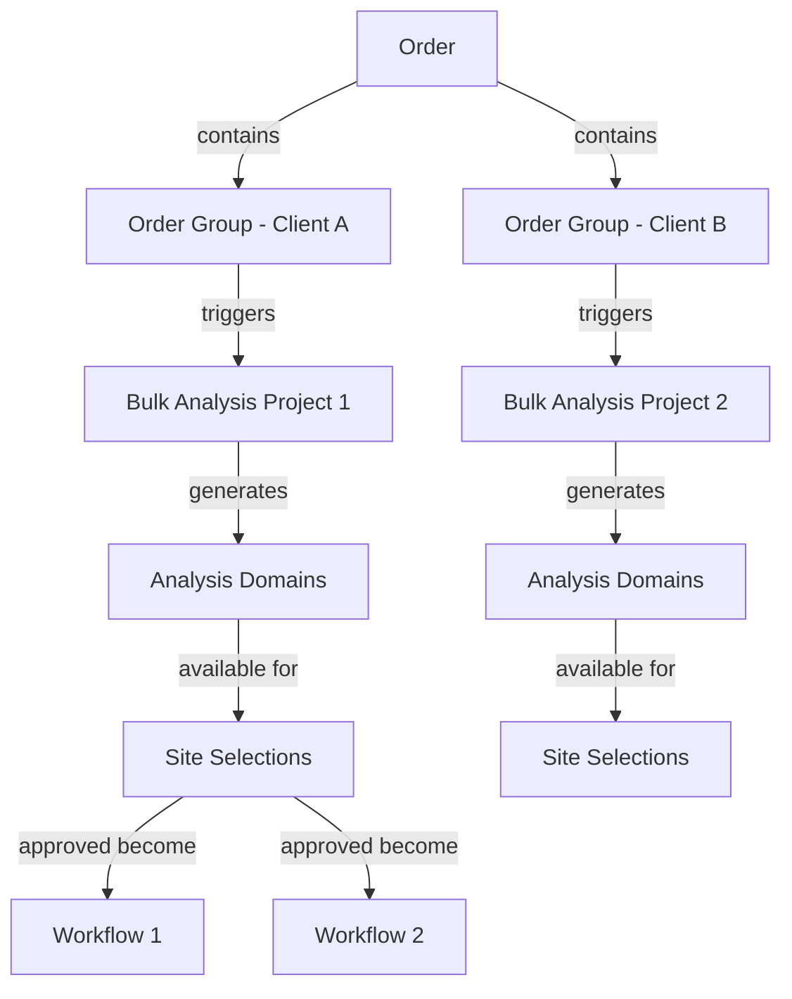
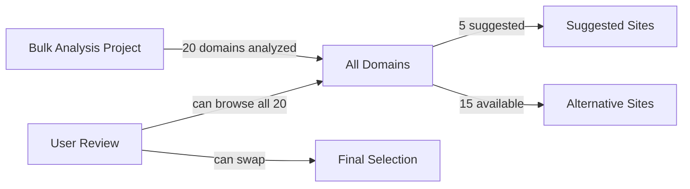

# Order System Schema Design

## Current vs Required Schema

### Current Structure (Problematic)
- Orders exist but disconnected from bulk analysis
- Workflows linked to orders but not to specific sites
- No way to track which bulk analysis led to which order
- No client review mechanism
- No share/preview system
- No support for multi-client orders

### Required Structure
Orders need to support flexible multi-client configurations:
1. One order can contain multiple clients
2. Each client segment gets its own bulk analysis project
3. Site review shows full analysis results (not just pre-selected)
4. Workflows created per individual link placement
5. Share tokens for sales process

## New Schema Tables

### 1. Order State Tracking
```sql
-- Add to orders table
ALTER TABLE orders ADD COLUMN state VARCHAR(50) DEFAULT 'draft';
ALTER TABLE orders ADD COLUMN requires_client_review BOOLEAN DEFAULT false;
ALTER TABLE orders ADD COLUMN reviewed_at TIMESTAMP;
ALTER TABLE orders ADD COLUMN reviewed_by UUID;
-- Remove analysis_project_id as orders can have multiple projects
```

### 2. Order Groups (Client Segments within Order)
```sql
CREATE TABLE order_groups (
  id UUID PRIMARY KEY DEFAULT gen_random_uuid(),
  order_id UUID NOT NULL REFERENCES orders(id) ON DELETE CASCADE,
  client_id UUID NOT NULL REFERENCES clients(id),
  link_count INTEGER NOT NULL,
  target_pages JSONB, -- Array of target page URLs/IDs
  anchor_texts JSONB, -- Preferred anchor texts
  special_requirements TEXT,
  bulk_analysis_project_id UUID REFERENCES bulk_analysis_projects(id),
  group_status VARCHAR(50) DEFAULT 'pending',
  created_at TIMESTAMP NOT NULL DEFAULT NOW(),
  updated_at TIMESTAMP NOT NULL DEFAULT NOW()
);

CREATE INDEX idx_order_groups_order ON order_groups(order_id);
CREATE INDEX idx_order_groups_client ON order_groups(client_id);
```

### 3. Order Site Selections (Per Group)
```sql
CREATE TABLE order_site_selections (
  id UUID PRIMARY KEY DEFAULT gen_random_uuid(),
  order_group_id UUID NOT NULL REFERENCES order_groups(id) ON DELETE CASCADE,
  domain_id UUID NOT NULL REFERENCES bulk_analysis_domains(id),
  status VARCHAR(50) NOT NULL DEFAULT 'suggested', -- suggested, approved, rejected, alternate
  target_page_url TEXT, -- Which specific target page this is for
  anchor_text VARCHAR(255), -- Specific anchor text for this placement
  client_notes TEXT,
  internal_notes TEXT,
  selected_at TIMESTAMP,
  selected_by UUID REFERENCES users(id),
  created_at TIMESTAMP NOT NULL DEFAULT NOW(),
  updated_at TIMESTAMP NOT NULL DEFAULT NOW()
);

CREATE INDEX idx_order_site_selections_group ON order_site_selections(order_group_id);
CREATE INDEX idx_order_site_selections_status ON order_site_selections(status);
```

### 3. Order Share Tokens (for Sales)
```sql
CREATE TABLE order_share_tokens (
  id UUID PRIMARY KEY DEFAULT gen_random_uuid(),
  order_id UUID NOT NULL REFERENCES orders(id) ON DELETE CASCADE,
  token VARCHAR(255) NOT NULL UNIQUE,
  expires_at TIMESTAMP NOT NULL,
  allowed_actions TEXT[], -- ['view', 'convert', 'approve']
  created_by UUID NOT NULL REFERENCES users(id),
  used_at TIMESTAMP,
  converted_to_account_id UUID REFERENCES accounts(id),
  metadata JSONB, -- tracking info, UTM params, etc
  created_at TIMESTAMP NOT NULL DEFAULT NOW()
);

CREATE INDEX idx_share_tokens_token ON order_share_tokens(token);
CREATE INDEX idx_share_tokens_expires ON order_share_tokens(expires_at);
```

### 5. Client Default Requirements
```sql
-- Add to clients table for default requirements
ALTER TABLE clients ADD COLUMN default_requirements JSONB DEFAULT '{}';
-- Example: {"min_dr": 30, "min_traffic": 1000, "preferred_niches": ["tech", "business"]}

-- Order groups can override client defaults
ALTER TABLE order_groups ADD COLUMN requirement_overrides JSONB DEFAULT '{}';
```

## Relationships

### Multi-Client Order Structure


### Site Review Flow


## API Design for Account Access

### 1. Get Order with Multi-Client Context
```typescript
// GET /api/account/orders/[orderId]
{
  id: "order-123",
  state: "pending_review",
  totalLinks: 6, // 2 + 3 + 1 across clients
  groups: [
    {
      id: "og-1",
      client: { name: "Client A", website: "clienta.com" },
      linkCount: 2,
      targetPages: ["clienta.com/services", "clienta.com/about"],
      bulkAnalysisProject: {
        id: "bap-1",
        totalAnalyzed: 20,
        suggestedCount: 5
      },
      siteSelections: [
        {
          domain: "example.com",
          metrics: { dr: 45, traffic: 5000 },
          status: "approved",
          targetPage: "clienta.com/services",
          anchorText: "business services"
        }
      ]
    },
    {
      id: "og-2",
      client: { name: "Client B", website: "clientb.com" },
      linkCount: 3,
      // ... similar structure
    }
  ]
}
```

### 2. Site Review Interface
```typescript
// GET /api/account/orders/[orderId]/groups/[groupId]/available-sites
// Returns ALL analyzed domains, not just suggested
{
  suggested: [
    { id: "123", domain: "example.com", dr: 45, status: "suggested" }
  ],
  alternatives: [
    { id: "456", domain: "other.com", dr: 40, status: "available" },
    // ... all other analyzed domains
  ]
}

// POST /api/account/orders/[orderId]/groups/[groupId]/review-sites
{
  selections: [
    { 
      domainId: "123", 
      status: "approved",
      targetPage: "clienta.com/services",
      anchorText: "custom anchor" 
    },
    { 
      domainId: "456", // User selected from alternatives
      status: "approved",
      targetPage: "clienta.com/about",
      anchorText: "about us"
    }
  ]
}
```

### 3. Share Token Generation
```typescript
// POST /api/orders/[orderId]/share
{
  expiresIn: "7d",
  allowedActions: ["view", "convert"],
  metadata: { source: "email_campaign" }
}
// Returns: { shareUrl: "https://postflow.com/share/order/abc123xyz" }
```

## Use Case Implementations

### Multi-Client Agency Order
1. Account creates order → state: 'draft'
2. Adds multiple client groups (Client A: 2 links, Client B: 3 links)
3. System runs separate bulk analysis per client group
4. Account reviews sites per group:
   - Can approve suggested sites
   - Can browse ALL analyzed sites and pick alternatives
   - Can set specific anchor text per placement
5. Payment for entire order → state: 'in_progress'
6. Individual workflows created per link placement
7. All workflows complete → state: 'completed'

### Flexible Site Review
```
Client A Group:
├── 20 sites analyzed
├── 5 suggested by system
├── User reviews all 20
├── Approves 1 suggested
└── Picks 1 alternative from the other 15

Result: 2 workflows created for Client A
```

## Migration Considerations

### Existing Orders
- Backfill analysis_project_id where possible
- Set state based on current status
- Create placeholder site selections

### Existing Workflows
- Already linked via order_item_id
- No changes needed

### New Permissions
```typescript
// Account can only see orders where:
orders.account_id = session.accountId
OR 
order_share_tokens.token = providedToken
```

## Client Default Requirements Strategy

### Philosophy
The system's value is finding relevant sites without rigid DR/traffic requirements. However, some clients still want guidelines.

### Implementation
```typescript
// When adding a client to the system
interface ClientDefaults {
  minDR?: number;           // Optional
  minTraffic?: number;      // Optional  
  preferredNiches?: string[]; // Optional
  avoidCompetitors?: string[]; // Domains to avoid
  customGuidelines?: string;   // Free text
}

// Stored in clients.default_requirements JSONB
// Applied automatically during bulk analysis
// Can be overridden per order group
```

### Benefits
1. Set once when creating client, not every order
2. Flexible - can have requirements or not
3. Maintains system philosophy - relevance first
4. Easy to override for specific orders

This schema design creates a cohesive order-centric system that:
- Supports multi-client orders efficiently
- Provides full transparency in site selection
- Maintains flexibility for different client needs
- Scales from simple to complex use cases