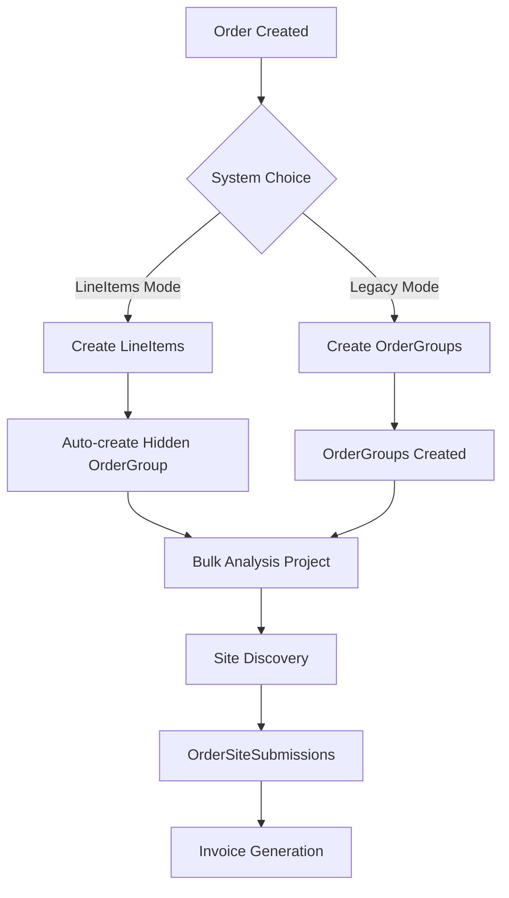

# Order System Current State Documentation
*Last Updated: 2025-01-08*

## Executive Summary

The order system uses a **dual architecture** where both `orderGroups` and `lineItems` coexist, but serve different critical functions. While lineItems are the user-facing future, orderGroups remain essential backend infrastructure for bulk analysis integration.

## The Two Systems and Their Roles

### LineItems (User-Facing, Primary)
- **Purpose**: Granular order management with individual item control
- **Visibility**: Shown in UI, what users interact with
- **Features**:
  - Individual pricing per item
  - Direct domain assignment
  - Target page and anchor text per item
  - Better for flexible pricing models
  - Status tracking per item

### OrderGroups (Backend Infrastructure, Hidden but Critical)
- **Purpose**: Bridge to bulk analysis and site discovery
- **Visibility**: Mostly hidden from users, runs in background
- **Critical Functions**:
  - ✅ **Bulk Analysis Project Creation** - Only way to create projects
  - ✅ **Site Discovery Connection** - Links orders to site finding
  - ✅ **OrderSiteSubmissions** - All submissions require groupId
  - ✅ **Project-Order Associations** - Requires groupId reference

## Why OrderGroups Can't Be Removed (Yet)

### 1. Bulk Analysis Dependency
```typescript
// From /api/orders/[id]/confirm/route.ts
// Projects are created PER orderGroup, not per lineItem
const groups = await tx.select().from(orderGroups)...
groups.map(async ({ orderGroup, client }) => {
  // Create bulk analysis project
  if (!orderGroup.bulkAnalysisProjectId) {
    // This is the ONLY way projects get created
  }
})
```

### 2. Database Foreign Key Requirements
```sql
-- order_site_submissions table
orderGroupId uuid NOT NULL REFERENCES order_groups(id) -- REQUIRED

-- project_order_associations table  
orderGroupId uuid NOT NULL REFERENCES order_groups(id) -- REQUIRED
```

### 3. Site Selection Flow
All site selection/review flows depend on:
- `/api/orders/[id]/groups/[groupId]/submissions/*`
- OrderSiteReviewTable expects groupId
- Submissions stored with orderGroupId reference

## Current System Flow



## What Works Today

### LineItems System Handles:
- ✅ User-facing order creation
- ✅ Individual item management
- ✅ Flexible pricing
- ✅ Direct domain assignment
- ✅ Invoice generation (primary path)

### OrderGroups System Handles:
- ✅ Bulk analysis project creation
- ✅ Site discovery connection
- ✅ Submission tracking
- ✅ Project associations
- ✅ Invoice generation (fallback)

## Migration Status

### Already Migrated:
- Order creation UI uses lineItems
- Review tables support both systems
- Invoice generation checks lineItems first
- Order editing primarily uses lineItems

### Still Dependent on OrderGroups:
- Bulk analysis project creation
- All site submissions
- Project-order associations
- Site discovery workflow

## Future Migration Path

### Phase 1: Make OrderGroups Invisible (CURRENT STATE)
- ✅ Hide from UI
- ✅ Auto-create when using lineItems
- ✅ Use as backend plumbing only

### Phase 2: Add Bulk Analysis to LineItems (FUTURE)
- Add `bulkAnalysisProjectId` to lineItems
- Modify confirm route to work with lineItems
- Update submission system to use lineItemId

### Phase 3: Remove OrderGroups (FUTURE)
- Migrate all foreign keys
- Update all APIs
- Remove orderGroups tables

## Key Files and Dependencies

### Critical OrderGroup Dependencies:
1. `/app/api/orders/[id]/confirm/route.ts` - Creates bulk projects
2. `/lib/db/projectOrderAssociationsSchema.ts` - FK to orderGroups
3. `/lib/db/orderSiteSubmissions` - FK to orderGroups
4. All `/api/orders/[id]/groups/*` endpoints

### LineItems Primary Files:
1. `/app/orders/[id]/edit/page.tsx` - Order creation
2. `/app/api/orders/[id]/line-items/*` - LineItem management
3. `/components/orders/OrderSiteReviewTableV2.tsx` - Supports both

## Important Notes for Developers

1. **Don't Remove OrderGroups** - They're load-bearing infrastructure
2. **LineItems are the Future** - All new features should use lineItems
3. **Dual Support Required** - Components must handle both systems
4. **Hidden but Essential** - OrderGroups run in background even for lineItems orders

## Current Workarounds

### Auto-Creation Pattern
When order uses lineItems, system auto-creates a hidden orderGroup:
- Groups all lineItems by client
- Creates one orderGroup per unique client
- Links to bulk analysis
- Invisible to users

### Invoice Generation
```typescript
if (lineItems.length > 0) {
  // Use lineItems (primary)
} else {
  // Fall back to orderGroups (legacy)
}
```

## Testing Considerations

When testing orders, verify:
1. Bulk analysis projects are created (requires orderGroups)
2. Site submissions work (requires orderGroups)  
3. LineItems display correctly (user-facing)
4. Invoice generation handles both systems

## Summary

**The Reality**: We have a hybrid system where lineItems handle user interactions while orderGroups provide critical backend infrastructure. This is not ideal but is stable and works. Future migration to pure lineItems requires significant work to reconnect bulk analysis and submissions systems.

**For Now**: Accept the dual system, keep orderGroups hidden, and plan careful migration when resources allow.